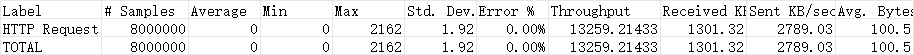

# Run the code
Execute run.cmd , configuration can be set through appconfig.properties
`java -jar bettingstake.jar`

# Requirement analysis

## HttpServer

### Solution selection

- Use com.sun.net.httpserver.HttpServer as a light-weighted server
- Customize thread-pool with ThreadPoolExecutor and set pool size properly to handle massive simultaneous requests
- Customize dispatch procedure inside http handler to support path variable. Cache for route handler metadata to
  accelerate dispatch operations.
- Implement annotation mimicking spring's @RequestMapping @Requestbody @Requestparam @PathVariable to simplify
  definition of controller route handler.

### Relevant configuration

- server port
- Core pool-size , max pool-size
- Incoming request acquire thread-pool thread timeout
- Response timeout

### Implement Class

com.everymatrix.server.CustomHttpServer

## Session Management

Provide a sliding-refresh session manager

### Solution selection

- Session expire strategy: lazy expire + schedule delete
- Session field: sessionKey , customerId, deleted flag , latestAccessTime(If latestAccessTime + config[timeout] <
  currentTime then session expired)
- data structure: ConcurrentHashMap<sessionKey , SessionObject>

### Configuration Options

- Session timeout duration

### Implement Class

com.everymatrix.service.SessionManager

## Bet-Offer Service

Persist Bet-Offer in memory with thread-safe code, and provide o(1) time-complexity query  via caching.

### Post stake solution

- Function define: void placeStake(betofferId , stake, customerId),
- Use Map<Long, Map<Long, TreeSet<Integer>>> where the outer key is customerId, the inner key is betOfferId, and the
  inner value is a TreeSet of stakes. The TreeSet enables efficient, ordered stake insertion.
- When a stake is added, TreeSet quickly identified as if it is the highest by the customer, if it is ,trigger an action
  to update the **HighStakeCache**.
- Use customerId to lock the procedure and guarantee thread-safe

### Query high stake with HighStakeCache

- Data structure: Map<Long, TreeSet<StakeEntry>>  Key: betOfferId, Value: TreeSet of customerId-stake pairs
- Upon posting a stake that triggers cache updates, insert the stake into TreeSet<StakeEntry> and pop the minimal stake if the customer-stake pair is not already in the cache, if it exists, update the StakeEntry.
- Use betOfferId to lock the procedure and guarantee thread-safe
- In production ,this design should consider consistency after a long run, which is not implemented in this project.

### Implement Class
com.everymatrix.service.BetOfferService

# Performance Testing

## Test Case
200 Thread simulate 100 customerId(customerId = ThreadNumber % 100) , get session and post random stake (1-10000) , Loop 10000 times in 10 minutes.

script: ./Test Plan.jmx
## Test Result

